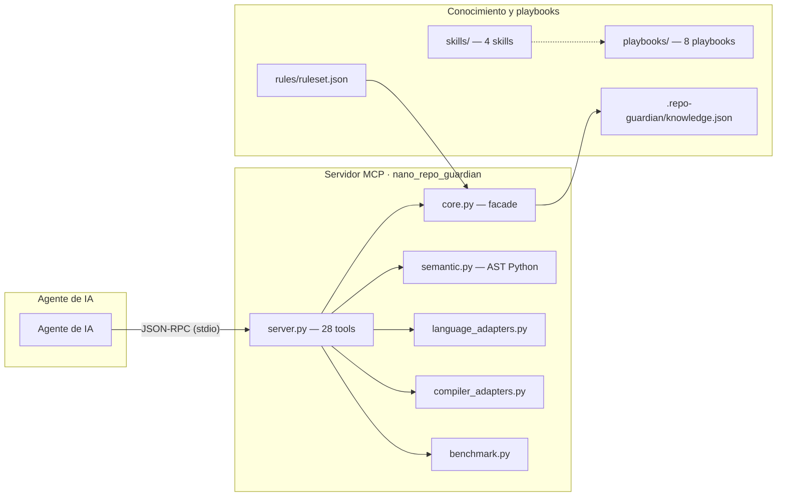
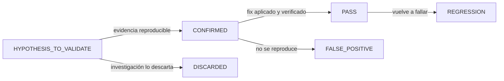
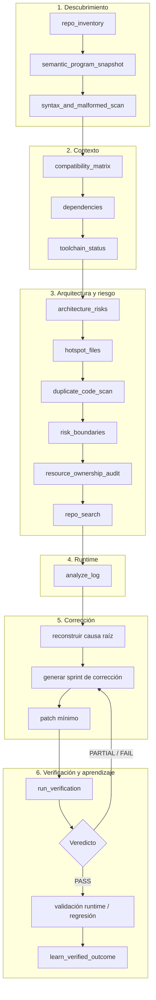

# Universal Repo Guardian Pro v3


**QA de ingeniería, forensia de código y corrección de bugs basada en evidencia**, agnóstico de repositorio y de agente.

> Principio rector: **la evidencia manda**. Un patrón de código es una hipótesis, no un bug. Nada se eleva a CONFIRMED sin verificación determinística o reproducible.

---

## Índice

1. [Qué es](#1-qué-es)
2. [Arquitectura](#2-arquitectura)
3. [Componentes](#3-componentes)
4. [Modelo de evidencia](#4-modelo-de-evidencia)
5. [Modelo de seguridad](#5-modelo-de-seguridad)
6. [Flujo de trabajo](#6-flujo-de-trabajo)
7. [Herramientas MCP](#7-herramientas-mcp-28)
8. [Ejemplos y evidencia](#8-ejemplos-y-evidencia)
9. [Instalación](#9-instalación)
10. [Tests](#10-tests)
11. [Notas](#11-notas)

---

## 1. Qué es

Universal Repo Guardian audita cualquier repositorio (Android, Flutter, Kotlin, Java, Dart, Rust, C/C++, JNI/FFI/NDK/CMake, Python, JS/TS, Go, C#, Swift, web y backend) y convierte los hallazgos en **sprints de corrección verificados**.

Tres pilares:

- **Escaneos determinísticos** — sintaxis Python (AST) y JSON (parseo real), marcadores de merge conflict. Lo que aquí aparece es CONFIRMED, no una suposición.
- **Fronteras de riesgo** — 33 reglas sobre errores, procesos, memoria nativa, JNI/FFI, concurrencia, red, TLS, shell/SQL y Flutter/Android. Son hipótesis a validar, salvo evidencia determinística.
- **Análisis semántico** — AST real para Python (símbolos y llamadas); para el resto de lenguajes, candidatos conservadores hasta verificación por compilador/parser.

## 2. Arquitectura



Dos capas:

- **`nano_repo_guardian/`** — el servidor MCP y su motor descompuesto en módulos de responsabilidad única (escáneres, contexto, semántica, métricas, CFG). Es la única capa que se expone al agente.
- **Conocimiento** — skills, playbooks y la base de aprendizaje verificada (`.repo-guardian/knowledge.json`).

## 3. Componentes

### 3.1 Servidor MCP

`nano_repo_guardian/server.py` expone 28 herramientas por JSON-RPC sobre stdio. El motor está descompuesto en módulos de responsabilidad única (`scanners`, `analysis`, `semantic`, `metrics`, `cfg`, `knowledge`, `fsio`, `constants`).

### 3.2 Skills

- `nano-repo-surgeon` — auditoría QA profunda de cualquier repo (30 dimensiones) y sprints de corrección.
- `android-native-runtime-debugger` — diagnóstico de fallos nativos Android/JNI/Xvnc/VNC.
- `verification-gatekeeper` — 16 gates de verificación; nunca PASS solo por build.
- `adaptive-bug-intelligence` — aprendizaje versionado con evidencia.

### 3.3 Módulos internos

| Módulo | Responsabilidad |
|---|---|
| `constants` | Datos y reglas (riesgo, log, extensiones, build files, patrones, fingerprint). |
| `fsio` | Sistema de archivos (raíz segura, iteración, lectura). |
| `scanners` | Escáneres (sintaxis, riesgo, duplicados, manifest, imports, dead-code, entropía). |
| `analysis` | Contexto y agregación (inventario, compatibilidad, dependencias, logs, verify). |
| `knowledge` | Base de conocimiento adaptativa. |
| `semantic` | Análisis semántico (AST Python + candidatos multilenguaje). |
| `metrics` | Motor cuantitativo (ciclomática, grafos, scores, precisión/recall). |
| `cfg` | CFG y taint source→sink. |
| `process_model` | Modelo de procesos para forensia de runtime. |

### 3.4 Playbooks

`playbooks/` contiene 8 guías forenses para familias comunes de bugs: ciclo de vida Android, deadlock, conflicto de dependencias, renderizado Flutter, crash JNI, fuga de memoria, reconexión de red y procesos zombi.

### 3.5 Reglas y conocimiento

- `rules/ruleset.json` — estados de evidencia, estados de verificación, resultados de aprendizaje y acciones prohibidas.
- `knowledge/seed.json` — semilla de la base de aprendizaje (v1).
- `.repo-guardian/knowledge.json` — base local, escrita solo por `learn_verified_outcome`.

## 4. Modelo de evidencia

Cada hallazgo vive en un estado. El patrón no es prueba:

| Estado | Significado |
|---|---|
| `CONFIRMED` | Bug verificado con evidencia reproducible. |
| `HYPOTHESIS_TO_VALIDATE` | Patrón o sospecha pendiente de validación. |
| `DISCARDED` | Descartado tras investigación. |
| `INFORMATIONAL` | Dato informativo, no defecto. |

Y un fix solo se cierra con veredicto defendible:

| Veredicto | Significado |
|---|---|
| `PASS` | Todos los gates aplicables superados. |
| `PARTIAL` | Algunos gates superados, otros pendientes. |
| `FAIL` | Algún gate crítico falla. |
| `UNVERIFIED` | Sin evidencia suficiente para veredicto. |



Reglas de veracidad (skills): `NO VERIFICADO`, `REQUIERE PRUEBA DINÁMICA` y `REQUIERE VERIFICACIÓN DE COMPATIBILIDAD` se declaran explícitamente cuando no hay evidencia cerrada.

### 4.1 Análisis cuantitativo (sin números inventados)

Todo número que emite la herramienta declara cómo se obtuvo:

| Naturaleza | Significado | Ejemplo |
|---|---|---|
| `MEDIDO` | Leído directamente del código | nº de nodos/aristas, LOC |
| `CALCULADO` | Fórmula determinística sobre lo medido | ciclomática (McCabe), centralidad, blast radius |
| `ESTIMADO` | Suma ponderada con pesos razonados | risk score, confidence, function risk |
| `HEURISTICO` | Patrón aproximado, sujeto a falso positivo | concurrencia, ownership textual, state flags |

Motor cuantitativo (`nano_repo_guardian/metrics.py`):

- **Complejidad ciclomática** — vía `radon` (McCabe) por función, con fallback AST propio. `M = decisiones + 1`.
- **Grafo de dependencias** — vía `networkx`: indegree/outdegree, centralidad de grado e intermediación, ciclos (SCC), orden topológico y camino crítico.
- **Blast radius** — fracción del sistema que depende transitivamente de un módulo: `BR = afectados / total`, más versión ponderada por centralidad.
- **Data flow** — uso-antes-de-asignación y asignación-sin-lectura (Python, lineal conservador).
- **Scores** — `RiskScore = Severity × Probability × BlastRadius × Centrality × Detectability` (0–100); prioridad y confianza con pesos explícitos.
- **Riesgo de función (FR)** — combina ciclomática medida + llamadas/asignaciones/ramas/recursos/concurrencia reales del AST + centralidad.

Ningún score se presenta como medición real: los pesos son heurística razonada y quedan siempre etiquetados.

## 5. Modelo de seguridad

- El MCP **NO** expone ejecución de shell arbitraria.
- Los comandos de verificación usan una allow-list estricta (`git diff --check`, `cargo`, `dart/flutter analyze`, `go test`).
- El aprendizaje adaptativo escribe **únicamente** `.repo-guardian/knowledge.json`.
- Los matches por patrón son hipótesis salvo evidencia determinística (ej. merge conflict).
- No se descargan grammars/parsers automáticamente; Tree-sitter es opcional y devuelve `UNVERIFIED` hasta configurarse explícitamente.

## 6. Flujo de trabajo



El bucle de verificación es obligatorio: si `run_verification` no da `PASS`, se vuelve al sprint de corrección. Solo se registra aprendizaje (`learn_verified_outcome`) de resultados **verificados**.

## 7. Herramientas MCP (28)

**Inventario y contexto**

| Herramienta | Propósito |
|---|---|
| `repo_inventory` | Lenguajes, archivos de build, archivos críticos, tests. |
| `language_adapter_inventory` | Qué lenguajes hay y qué adaptador los cubre. |
| `toolchain_status` | Disponibilidad de toolchains (python, gradle, cargo, go…). |
| `compatibility_matrix` | compileSdk/targetSdk/NDK, Gradle, Flutter, Rust, Node, Go, Python. |
| `dependencies` | Dependencias declaradas (npm/pub/Gradle/pip). |
| `recommended_compiler_verifiers` | Verificadores recomendados según los build files. |
| `repository_deep_snapshot` | Snapshot completo de ingeniería. |
| `benchmark_fixture_status` | Estado de los fixtures de benchmark. |

**Escaneo**

| Herramienta | Propósito |
|---|---|
| `syntax_and_malformed_scan` | Sintaxis Python/JSON + merge conflicts (CONFIRMED). |
| `risk_boundaries` | 33 reglas de fronteras de riesgo (hipótesis salvo evidencia). |
| `architecture_risks` | Candidatos a god-file y complejidad de ramas. |
| `duplicate_code_scan` | Bloques duplicados exactos entre archivos. |
| `hotspot_files` | Ranking de hotspots de ingeniería. |
| `resource_ownership_audit` | Desbalance malloc/free, socket/close, controllers/dispose. |
| `android_manifest_audit_tool` | Permisos, componentes exportados, cleartext, backup, debuggable. |
| `imports_audit_tool` | Duplicados (CONFIRMED), wildcards y no-usados. |
| `dead_code_scan_tool` | Candidatos a código muerto (heurística). |

**Semántica**

| Herramienta | Propósito |
|---|---|
| `semantic_program_snapshot` | Símbolos y llamadas (AST real Python; candidatos en otros lenguajes). |
| `semantic_call_consistency` | Llamadas sin resolver (hipótesis). |

**Búsqueda y logs**

| Herramienta | Propósito |
|---|---|
| `repo_search` | Búsqueda de texto sin shell. |
| `analyze_log` | Agrupación de logs por fingerprint + señal más temprana. |

**Incremental y aprendizaje**

| Herramienta | Propósito |
|---|---|
| `scan_changed_files` | Escaneo sobre git diff. |
| `knowledge_status` | Lee la base de aprendizaje verificada. |
| `learn_verified_outcome` | Registra SOLO resultados verificados. |
| `run_verification` | Comandos de verificación con allow-list. |

**Métricas cuantitativas**

| Herramienta | Propósito |
|---|---|
| `cyclomatic_complexity_report` | Complejidad ciclomática (McCabe) por función + índice de mantenibilidad. |
| `dependency_graph_metrics` | Grafo de dependencias: centralidad, ciclos, orden topológico, camino crítico. |
| `quantitative_risk_report` | Reporte agregado: ciclomática + grafo + concurrencia + estado + risk scores. |

## 8. Ejemplos y evidencia

Salida real ejecutando las herramientas sobre los `fixtures/` del propio repo.

**Inventario** detecta lenguajes y versión:

```json
{
  "guardian_version": "3.0.0",
  "files_scanned": 4,
  "languages": { "kotlin": 1, "c_cpp": 1, "python": 1 }
}
```

**Auditoría de propiedad de recursos** (`resource_ownership_audit`) sobre `native_leak.c` (`void f(){ void* p = malloc(16); }`):

```json
{
  "file": "native_leak.c",
  "resource": "malloc",
  "severity": "P1",
  "status": "HYPOTHESIS_TO_VALIDATE",
  "acquire_mentions": 1,
  "release_mentions": 0
}
```

`malloc` aparece 1 vez y `free` 0 veces → desbalance. Sigue siendo **hipótesis**: un wrapper, RAII o liberación en otro archivo podría explicarlo.

**Snapshot semántico** sobre `python_call_graph.py` (`def a(): b()`) y `kotlin_symbols.kt`:

```json
[
  { "name": "Demo",   "kind": "symbol_candidate", "language": "kotlin" },
  { "name": "run",    "kind": "symbol_candidate", "language": "kotlin" },
  { "name": "helper", "kind": "symbol_candidate", "language": "kotlin" },
  { "name": "a",      "kind": "function",          "language": "python" },
  { "name": "b",      "kind": "function",          "language": "python" }
]
```

Python usa AST (kind `function`); Kotlin produce `symbol_candidate` hasta verificación por compilador.

**Análisis de log** (`analyze_log`) agrupa incidentes por fingerprint y devuelve la señal de alta severidad más temprana:

```json
{
  "groups": [
    { "category": "not_found",           "severity": "P1", "count": 2, "first_line": 1 },
    { "category": "linker",              "severity": "P1", "count": 2, "first_line": 1 },
    { "category": "permission_exec",     "severity": "P1", "count": 1, "first_line": 3 },
    { "category": "surface_backpressure", "severity": "P1", "count": 1, "first_line": 4 }
  ],
  "earliest_high": "not_found"
}
```

## 9. Instalación

### Requisitos

- Python ≥ 3.10
- `pip install mcp`

### MCP server

1. Copiar `nano_repo_guardian/` a una ubicación estable (ej. `~/.claude/mcp-servers/nano-repo-guardian/`).
2. Registrar en el archivo de configuración del agente (`~/.claude/.claude.json` en tu agente), bajo la clave raíz `mcpServers`:

```json
"nano-repo-guardian": {
  "type": "stdio",
  "command": "python",
  "args": ["C:\\Users\\<usuario>\\.claude\\mcp-servers\\nano-repo-guardian\\nano_repo_guardian\\server.py"],
  "env": {}
}
```

3. Reiniciar el agente y verificar con `/mcp` → debe mostrar `nano-repo-guardian √ Connected`.

El server funciona como script (`python server.py`) o módulo (`python -m nano_repo_guardian.server`) y fuerza UTF-8 en stdout para Windows.

### Skills

Copiar cada carpeta de `skills/` a la carpeta de skills del agente (ej. `~/.claude/skills/`) — quedan activas en la siguiente sesión.

### Como paquete pip (opcional)

```powershell
cd universal-repo-guardian
python -m venv .venv
.venv\Scripts\Activate.ps1
pip install -e .
nano-repo-guardian
```

Tree-sitter es opcional: `pip install -e ".[tree_sitter]"`.

## 10. Tests

```powershell
python -m pytest tests/ -q
```

Resultado actual: **41/41 passing** — 19 de core, 4 de semántica v3, 12 de métricas, 2 de protocolo MCP y 4 de módulos consolidados (CFG, entropía, compatibilidad, detección).

## 11. Notas

Esta herramienta mejora el ranking de detección con historial verificado, pero **no garantiza matemáticamente** encontrar todos los defectos de software posibles. El análisis estático es triaje; fuga de memoria, races, deadlocks y timeouts requieren prueba dinámica.
